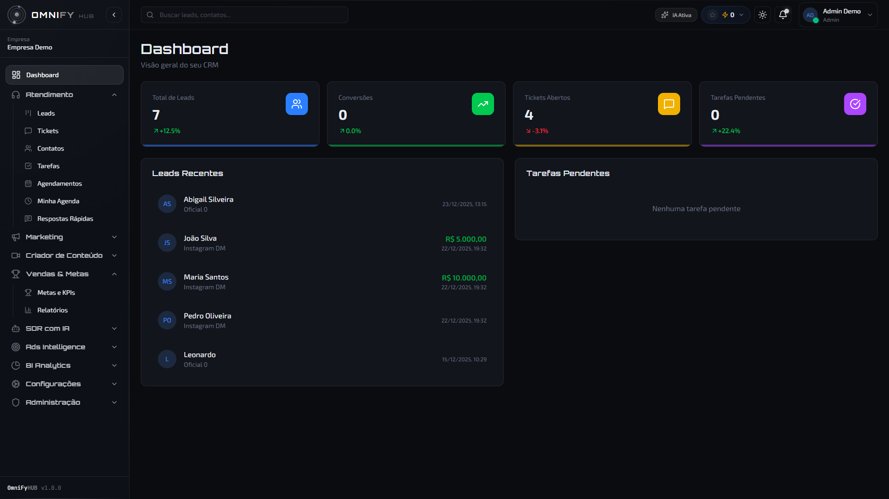
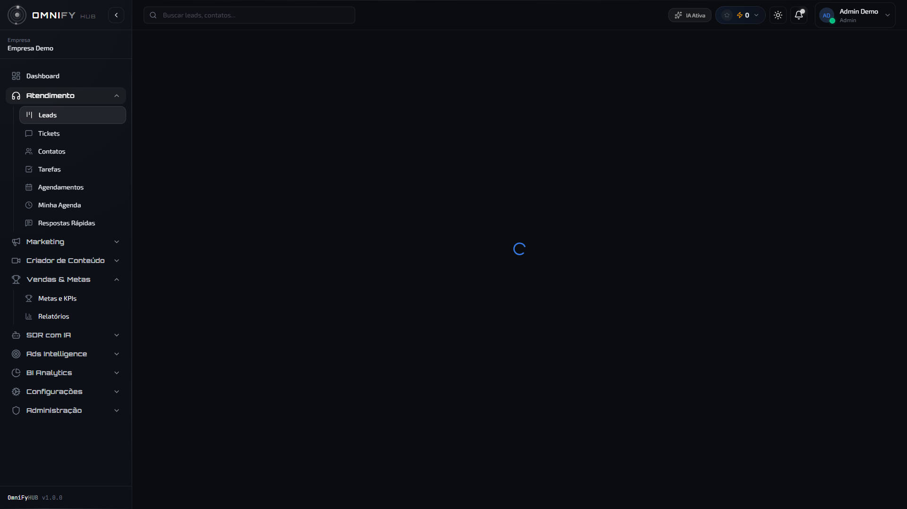
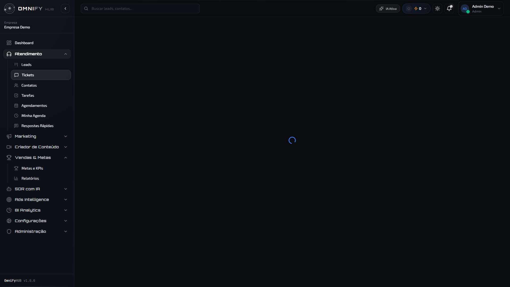
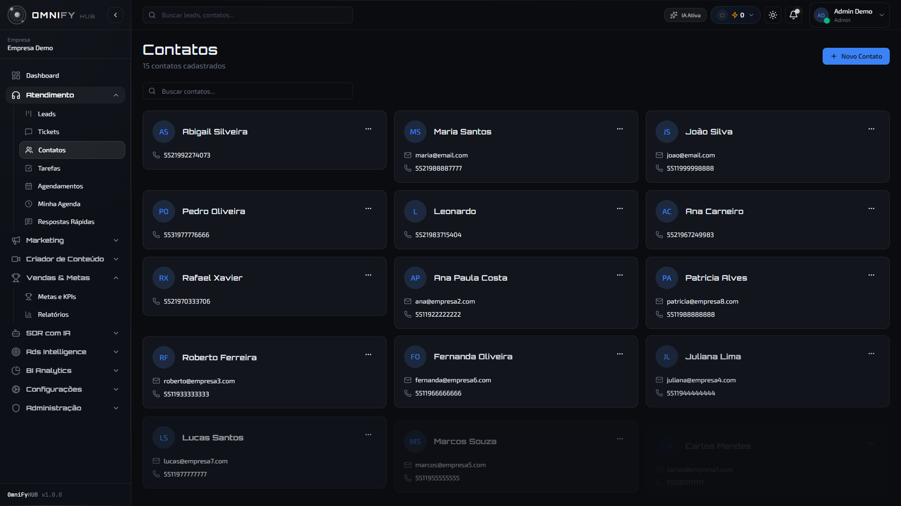
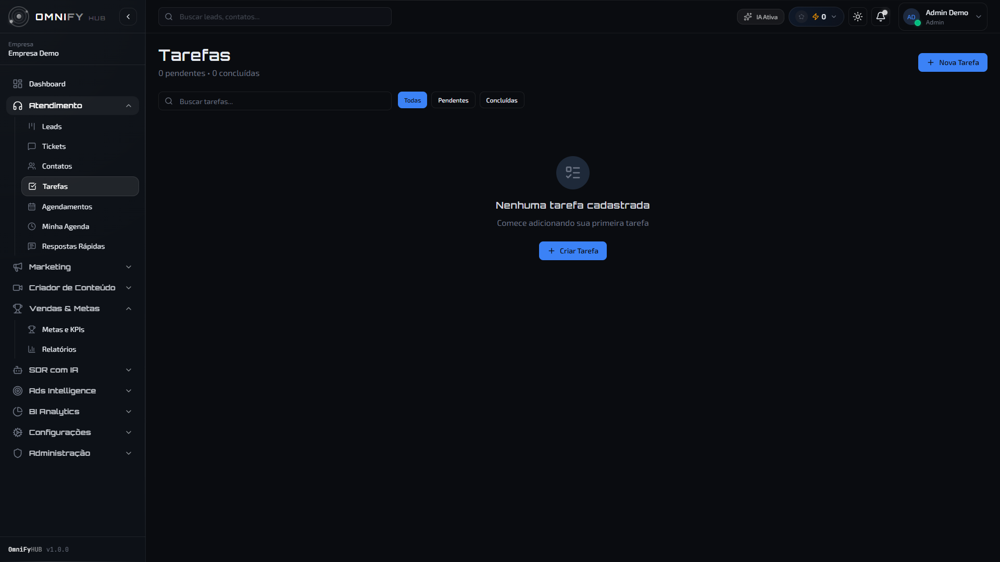
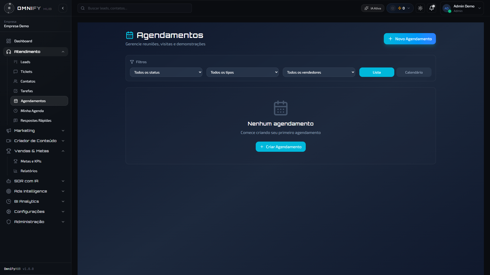
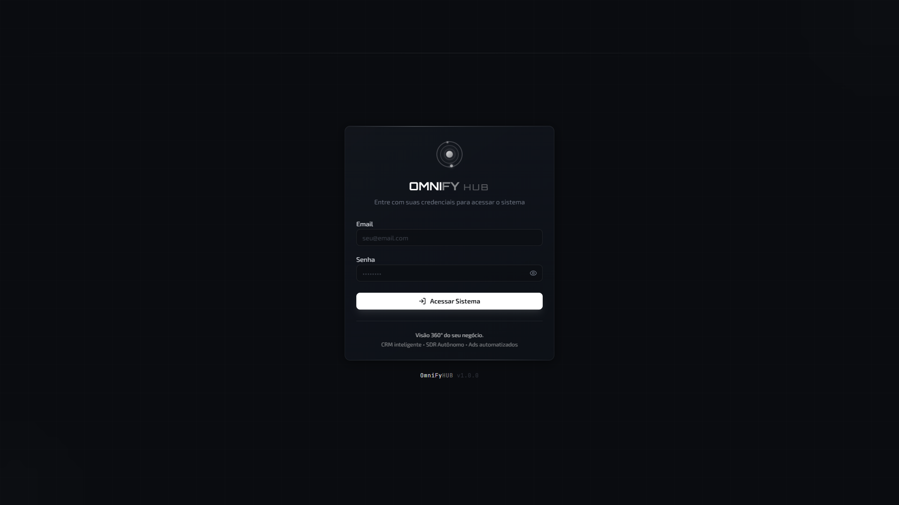

# Manual de Usabilidade - OmniFy HUB CRM

**Versão:** 1.0
**Última atualização:** Dezembro 2025

---

## Índice

1. [Introdução](#1-introdução)
2. [Dashboard Principal](#2-dashboard-principal)
3. [Módulo de Atendimento](#3-módulo-de-atendimento)
   - 3.1 [Leads (Kanban)](#31-leads-kanban)
   - 3.2 [Tickets](#32-tickets)
   - 3.3 [Contatos](#33-contatos)
   - 3.4 [Tarefas](#34-tarefas)
   - 3.5 [Agendamentos](#35-agendamentos)
   - 3.6 [Minha Agenda](#36-minha-agenda)
   - 3.7 [Respostas Rápidas](#37-respostas-rápidas)
4. [Módulo de Marketing](#4-módulo-de-marketing)
   - 4.1 [Produtos](#41-produtos)
   - 4.2 [Landing Pages](#42-landing-pages)
5. [Criador de Conteúdo](#5-criador-de-conteúdo)
6. [Metas e Vendas](#6-metas-e-vendas)
7. [SDR com IA](#7-sdr-com-ia)
8. [Ads Intelligence](#8-ads-intelligence)
9. [BI Analytics](#9-bi-analytics)
10. [Configurações](#10-configurações)
11. [Funcionalidades Especiais](#11-funcionalidades-especiais)
12. [Administração](#12-administração)
13. [Dicas e Atalhos](#13-dicas-e-atalhos)

---

# 1. Introdução

## O que é o OmniFy HUB?

O OmniFy HUB é uma plataforma completa de CRM (Customer Relationship Management) com inteligência artificial integrada. Ele permite gerenciar leads, atender clientes via WhatsApp e Instagram, criar campanhas de marketing, acompanhar metas de vendas e muito mais.

## Como fazer login

#### Passo a passo:

1. Acesse o sistema pelo navegador (Chrome recomendado)
2. Digite seu **email** cadastrado
3. Digite sua **senha**
4. Clique em **Entrar**


#### Dicas:
- Use uma senha forte com letras, números e símbolos
- Se esqueceu a senha, clique em "Esqueci minha senha"
- O sistema funciona melhor nos navegadores Chrome, Firefox ou Edge

#### FAQ:
**P: O que fazer se minha senha não funciona?**
R: Clique em "Esqueci minha senha" para receber um link de redefinição por email. Se o problema persistir, contate o administrador.

**P: Posso usar o sistema no celular?**
R: Sim! O sistema é responsivo e funciona em smartphones, mas recomendamos usar em computador para melhor experiência.

---

## Navegação básica

Após o login, você verá o menu lateral à esquerda com todas as funcionalidades organizadas em grupos:



| Grupo | Funcionalidades |
|-------|-----------------|
| **Principal** | Dashboard |
| **Atendimento** | Leads, Tickets, Contatos, Tarefas, Agendamentos, Respostas Rápidas |
| **Marketing** | Produtos, Landing Pages |
| **Criador de Conteúdo** | Dashboard, Chat IA, Criadores, Busca Viral |
| **Vendas & Metas** | Metas, Relatórios |
| **SDR com IA** | Agentes SDR |
| **Ads Intelligence** | Dashboard Ads, Campanhas, Insights |
| **BI Analytics** | Dashboard BI, Analista IA (admin) |
| **Configurações** | Perfil, Empresa, Equipe, etc. |

---

# 2. Dashboard Principal

**Rota:** `/`

## O que é

O Dashboard é a tela inicial do sistema, mostrando uma visão geral de todas as métricas importantes do seu negócio em um só lugar.


## O que você encontra

### Cards de KPIs (Indicadores)

No topo da página, 4 cards mostram os principais números:

| Card | O que mostra | Ícone |
|------|-------------|-------|
| **Total de Leads** | Quantidade de leads cadastrados | Usuários |
| **Conversões** | Percentual de leads convertidos em vendas | Gráfico |
| **Tickets Abertos** | Conversas aguardando resposta | Mensagem |
| **Tarefas Pendentes** | Atividades a realizar | Checklist |

### Gráficos

- **Gráfico de tendência:** Mostra a evolução dos leads ao longo do tempo
- **Gráfico de funil:** Visualize a distribuição dos leads por estágio

### Listas

- **Leads Recentes:** Os últimos leads que entraram no sistema
- **Tarefas Pendentes:** Suas próximas atividades a realizar

## Como usar

1. Ao fazer login, você já está no Dashboard
2. Clique em qualquer card para ver mais detalhes
3. Use os gráficos para analisar tendências
4. Clique em um lead da lista para abrir o chat

#### Exemplo prático:
> **Cenário:** Maria é vendedora e acabou de começar o dia.
>
> Ela abre o Dashboard e vê que tem **3 tickets abertos** (clientes esperando resposta) e **5 tarefas pendentes** para hoje. Ela clica no card de tickets para priorizar os atendimentos.

#### Dicas:
- Verifique o Dashboard toda manhã para planejar seu dia
- O card de tickets mostra conversas que precisam de atenção urgente
- Clique nos números para ir direto para a lista completa

---

# 3. Módulo de Atendimento

O módulo de Atendimento é o coração do CRM, onde você gerencia seus leads e clientes.

---

## 3.1 Leads (Kanban)

**Rota:** `/leads`

### O que é

A tela de Leads mostra todas as oportunidades de venda em um quadro Kanban, organizadas por estágios do funil de vendas.



### Como acessar

1. No menu lateral, clique em **Atendimento**
2. Clique em **Leads**

### Entendendo o Kanban

O Kanban é um quadro visual com colunas, onde cada coluna representa um **estágio** do processo de vendas:

```
| Novo Lead | Qualificado | Proposta | Negociação | Fechado |
|-----------|-------------|----------|------------|---------|
| Card 1    | Card 4      | Card 6   | Card 8     | Card 10 |
| Card 2    | Card 5      | Card 7   | Card 9     |         |
| Card 3    |             |          |            |         |
```

Cada "card" representa um lead com:
- Nome do cliente
- Valor da oportunidade
- Tempo no estágio
- Canal de origem (WhatsApp, Instagram, etc.)

### Como usar

#### Criar novo lead

1. Clique no botão **+ Novo Lead** no canto superior
2. Preencha os dados:
   - Nome do contato
   - Telefone
   - Email (opcional)
   - Valor estimado
   - Pipeline/Estágio inicial
3. Clique em **Salvar**


#### Mover lead entre estágios

1. Clique e segure no card do lead
2. Arraste para o estágio desejado
3. Solte o card

Ou:
1. Clique no card para abrir
2. Use o seletor de estágio no painel lateral

#### Abrir chat com lead

1. Clique no card do lead
2. O painel lateral abrirá com o chat
3. Digite sua mensagem e pressione Enter

#### Filtrar leads

Use os botões de filtro no topo:
- **Todos:** Mostra todos os leads
- **Pendentes:** Leads aguardando primeira resposta
- **Em Atendimento:** Conversas ativas
- **Encerrados:** Conversas finalizadas

#### Importar leads em lote

1. Clique no botão **Importar**
2. Faça upload de um arquivo CSV ou Excel
3. Mapeie as colunas (nome, telefone, email)
4. Confirme a importação


### Exemplo prático

> **Cenário:** João recebeu uma lista de 50 leads de uma feira.
>
> 1. Ele clica em **Importar** e faz upload do arquivo Excel
> 2. Mapeia as colunas: "Nome Completo" → Nome, "Celular" → Telefone
> 3. Todos os leads aparecem automaticamente no estágio "Novo Lead"
> 4. João começa a atender um por um, movendo para "Qualificado" os interessados

### Dicas

- Use cores diferentes para identificar pipelines
- Leads parados há muito tempo ficam com borda vermelha
- O ícone de WhatsApp indica se há mensagens não lidas
- Pressione `/` no chat para usar respostas rápidas

### FAQ

**P: Como criar um novo pipeline?**
R: Vá em Configurações > Pipelines e clique em "Novo Pipeline".

**P: Posso ter leads em mais de um pipeline?**
R: Não, cada lead pertence a apenas um pipeline por vez.

**P: O que acontece quando movo um lead para "Fechado"?**
R: O sistema solicita os dados do cliente (nome completo, CPF, endereço) para registrar a venda.

---

## 3.2 Tickets

**Rota:** `/tickets`

### O que é

Tickets são as conversas ativas com seus clientes. Aqui você vê todas as conversas que precisam de atenção.



### Como acessar

1. Menu lateral > **Atendimento** > **Tickets**

### Status dos tickets

| Status | Cor | Significado |
|--------|-----|-------------|
| **Aberto** | Verde | Conversa ativa, aguardando sua resposta |
| **Pendente** | Amarelo | Aguardando alguma ação |
| **Aguardando Cliente** | Azul | Você respondeu, aguardando retorno |
| **Encerrado** | Cinza | Conversa finalizada |

### Como usar

#### Responder uma conversa

1. Clique no ticket na lista
2. O chat abre no painel direito
3. Digite sua mensagem
4. Pressione **Enter** ou clique em **Enviar**

#### Identificar mensagens não respondidas

- Um ícone piscando indica mensagens aguardando resposta
- A lista mostra "Última mensagem: Cliente" quando o cliente enviou por último

#### Transferir conversa

1. Abra o ticket
2. Clique no botão **Transferir**
3. Escolha o usuário ou fila de destino
4. Adicione uma observação (opcional)
5. Confirme

#### Encerrar conversa

1. Abra o ticket
2. Clique em **Encerrar**
3. Selecione o motivo (Venda, Sem interesse, etc.)
4. Confirme

### Exemplo prático

> **Cenário:** Ana está de plantão e precisa atender os tickets abertos.
>
> 1. Ela acessa a página de Tickets
> 2. Filtra por "Aberto" para ver só as conversas pendentes
> 3. Vê que há 5 tickets com ícone piscando (mensagens não lidas)
> 4. Abre o primeiro, lê a mensagem do cliente
> 5. Digita a resposta e envia
> 6. O status muda automaticamente para "Aguardando Cliente"

### Dicas

- Ordene por "Mais antigos" para atender primeiro quem espera há mais tempo
- Use filtros para ver apenas seus tickets ou de toda equipe
- O tempo de espera aparece em cada ticket

---

## 3.3 Contatos

**Rota:** `/contacts`

### O que é

A base de dados de todos os contatos cadastrados no sistema, independente de serem leads ou não.



### Como acessar

1. Menu lateral > **Atendimento** > **Contatos**

### Como usar

#### Buscar contato

1. Use a barra de busca no topo
2. Digite nome, telefone ou email
3. Os resultados aparecem automaticamente

#### Criar novo contato

1. Clique em **+ Novo Contato**
2. Preencha os campos:
   - Nome completo
   - Telefone (com DDD)
   - Email
   - Empresa (opcional)
3. Clique em **Salvar**

#### Editar contato

1. Clique no contato da lista
2. Altere os campos desejados
3. Clique em **Salvar**

### Exemplo prático

> **Cenário:** Pedro precisa encontrar o contato de um cliente antigo.
>
> 1. Acessa Contatos
> 2. Digita parte do nome na busca: "Silva"
> 3. Encontra "Maria Silva" na lista
> 4. Clica para ver o telefone e histórico

### Dicas

- Mantenha os contatos atualizados para facilitar buscas
- O histórico de conversas aparece ao clicar no contato
- Você pode criar um lead a partir de um contato existente

---

## 3.4 Tarefas

**Rota:** `/tasks`

### O que é

Gerenciador de atividades e follow-ups para não esquecer de nenhum compromisso.



### Como acessar

1. Menu lateral > **Atendimento** > **Tarefas**

### Tipos de tarefas

| Tipo | Ícone | Uso comum |
|------|-------|-----------|
| **Ligação** | Telefone verde | Ligar para cliente |
| **WhatsApp** | WhatsApp verde | Enviar mensagem |
| **Reunião** | Calendário roxo | Videoconferência ou presencial |
| **Follow-up** | Seta azul | Acompanhamento geral |
| **Outro** | Círculo cinza | Atividades diversas |

### Como usar

#### Criar tarefa

1. Clique em **+ Nova Tarefa**
2. Preencha:
   - Título (ex: "Ligar para João sobre proposta")
   - Tipo (Ligação, WhatsApp, etc.)
   - Data/hora de vencimento
   - Lead relacionado (opcional)
   - Descrição (opcional)
3. Clique em **Salvar**

#### Marcar como concluída

1. Clique no checkbox ao lado da tarefa
2. A tarefa é movida para "Concluídas"

#### Filtrar tarefas

- **Pendentes:** Tarefas a fazer
- **Concluídas:** Tarefas já realizadas
- **Atrasadas:** Tarefas com data vencida

### Exemplo prático

> **Cenário:** Carlos precisa lembrar de ligar para um cliente amanhã às 14h.
>
> 1. Clica em **+ Nova Tarefa**
> 2. Título: "Ligar para Maria - Proposta comercial"
> 3. Tipo: Ligação
> 4. Data: Amanhã, 14:00
> 5. Vincula ao lead "Maria Souza"
> 6. Salva
>
> No dia seguinte, às 14h, Carlos recebe uma notificação lembrando da tarefa.

### Dicas

- Crie tarefas imediatamente após cada conversa para não esquecer
- Vincule tarefas a leads para ter contexto
- Tarefas atrasadas aparecem em vermelho

---

## 3.5 Agendamentos

**Rota:** `/appointments`

### O que é

Calendário de reuniões, visitas e demonstrações agendadas com clientes.



### Como acessar

1. Menu lateral > **Atendimento** > **Agendamentos**

### Tipos de agendamento

| Tipo | Cor | Descrição |
|------|-----|-----------|
| **Reunião** | Azul | Videoconferência ou presencial |
| **Visita** | Roxo | Visita ao cliente |
| **Demo** | Verde | Demonstração do produto |
| **Follow-up** | Laranja | Acompanhamento |
| **Outro** | Cinza | Outros compromissos |

### Status

| Status | Ação possível |
|--------|--------------|
| **Agendado** | Confirmar, Cancelar, Remarcar |
| **Confirmado** | Marcar como Realizado ou No-show |
| **Realizado** | Concluído com sucesso |
| **Cancelado** | Foi cancelado |
| **No-show** | Cliente não compareceu |

### Como usar

#### Criar agendamento

1. Clique em **+ Novo Agendamento**
2. Preencha:
   - Título
   - Tipo (Reunião, Demo, etc.)
   - Data e horário
   - Lead/contato relacionado
   - Local ou link da reunião
3. Clique em **Salvar**

#### Confirmar agendamento

1. Clique no agendamento
2. Clique em **Confirmar**
3. O cliente pode ser notificado automaticamente

#### Marcar como realizado

1. Após a reunião, clique no agendamento
2. Clique em **Marcar como Realizado**
3. Adicione observações se desejar

### Exemplo prático

> **Cenário:** Fernanda agendou uma demo para quinta às 10h.
>
> 1. Na quarta, ela clica no agendamento e confirma
> 2. O cliente recebe uma mensagem de confirmação
> 3. Na quinta, após a demo, ela marca como "Realizado"
> 4. O histórico fica registrado no lead

### Dicas

- Configure lembretes automáticos para clientes
- Use "No-show" para rastrear clientes que faltam
- Você pode reagendar com um clique

---

## 3.6 Minha Agenda

**Rota:** `/schedule`

### O que é

Configuração pessoal dos seus horários de trabalho e disponibilidade.


### Como acessar

1. Menu lateral > **Atendimento** > **Minha Agenda**

### Como usar

#### Definir horários de trabalho

1. Para cada dia da semana, defina:
   - Horário de início (ex: 09:00)
   - Horário de fim (ex: 18:00)
   - Intervalo de almoço (ex: 12:00-13:00)
2. Desmarque dias que não trabalha

#### Bloquear períodos

1. Clique em **Bloquear Período**
2. Escolha a data e horário
3. Adicione uma descrição (ex: "Consulta médica")
4. Salve

#### Definir feriados

1. Vá na aba **Feriados**
2. Adicione as datas que não trabalhará
3. Esses dias não aparecem como disponíveis para agendamento

### Dicas

- Mantenha sua agenda atualizada para evitar conflitos
- Bloqueios aparecem em cinza no calendário
- Clientes só conseguem agendar em horários livres

---

## 3.7 Respostas Rápidas

**Rota:** `/quick-replies`

### O que é

Atalhos de mensagens pré-prontas para agilizar o atendimento no chat.


### Como acessar

1. Menu lateral > **Atendimento** > **Respostas Rápidas**

### Como usar

#### Criar resposta rápida

1. Clique em **+ Nova Resposta**
2. Preencha:
   - **Título:** Nome da resposta (ex: "Saudação")
   - **Atalho:** Gerado automaticamente do título (ex: `/saudacao`)
   - **Conteúdo:** O texto da mensagem
3. Clique em **Salvar**

#### Usar variáveis

Você pode usar variáveis que são substituídas automaticamente:

| Variável | O que insere |
|----------|-------------|
| `{nome_cliente}` | Nome completo do cliente |
| `{primeiro_nome}` | Primeiro nome do cliente |
| `{telefone}` | Telefone do cliente |
| `{email}` | Email do cliente |
| `{nome_atendente}` | Seu nome |
| `{nome_empresa}` | Nome da empresa |
| `{data_hoje}` | Data atual (dd/mm/yyyy) |
| `{hora_atual}` | Hora atual (HH:mm) |

**Exemplo de mensagem:**
```
Olá {primeiro_nome}! Tudo bem?

Aqui é {nome_atendente} da {nome_empresa}.

Como posso te ajudar hoje?
```

#### Usar no chat

1. No chat com o lead, digite `/`
2. Uma lista de atalhos aparece
3. Continue digitando para filtrar (ex: `/sau` filtra "saudacao")
4. Pressione **Enter** ou clique para inserir
5. O texto é inserido com as variáveis substituídas


#### Adicionar emojis

1. Ao criar/editar, clique no ícone de emoji
2. Escolha o emoji desejado
3. Ele é inserido no conteúdo

### Exemplo prático

> **Cenário:** Lucas atende muitos clientes e sempre manda a mesma saudação.
>
> 1. Ele cria uma resposta rápida:
>    - Título: "Boas vindas"
>    - Conteúdo: "Olá {primeiro_nome}! Bem-vindo(a) à {nome_empresa}! Como posso ajudar?"
>
> 2. No chat com Maria, ele digita `/boas`
> 3. O sistema sugere "Boas vindas"
> 4. Ele pressiona Enter
> 5. A mensagem aparece: "Olá Maria! Bem-vindo(a) à OmniFy! Como posso ajudar?"

### Dicas

- Crie respostas para perguntas frequentes (preço, horário, localização)
- Use emojis para deixar as mensagens mais amigáveis
- A ordem das respostas pode ser alterada arrastando

### FAQ

**P: Cada vendedor tem suas próprias respostas?**
R: Sim! Cada usuário gerencia sua própria lista de respostas rápidas.

**P: Como reordenar as respostas?**
R: Clique e arraste pelo ícone de 6 pontos ao lado de cada resposta.

---

# 4. Módulo de Marketing

---

## 4.1 Produtos

**Rota:** `/products`

### O que é

Catálogo de produtos e serviços que podem ser apresentados aos clientes diretamente pelo chat.


### Como acessar

1. Menu lateral > **Marketing** > **Produtos**

### Como usar

#### Cadastrar produto

1. Clique em **+ Novo Produto**
2. Preencha:
   - Nome do produto
   - Descrição curta
   - Descrição completa
   - Preço
   - Preço promocional (opcional)
   - Categoria
   - SKU/Código (opcional)
3. Clique em **Salvar**

#### Adicionar fotos

1. Abra o produto
2. Clique em **Adicionar Imagem**
3. Selecione até **4 imagens**
4. Defina qual é a imagem principal (clique na estrela)

> **Limite:** Máximo de 4 fotos por produto


#### Enviar produto no chat

1. No chat com o lead, clique no botão **Catálogo**
2. Busque o produto desejado
3. Escolha as opções:
   - [ ] Incluir descrição
   - [ ] Incluir preço
   - [ ] Incluir fotos
4. Clique em **Enviar**

O cliente receberá:
- Mensagem formatada com nome e preço
- Todas as fotos do produto


### Exemplo prático

> **Cenário:** Paula vende roupas e um cliente perguntou sobre um vestido.
>
> 1. No chat, ela clica em **Catálogo**
> 2. Busca "Vestido Florido"
> 3. Marca todas as opções (descrição, preço, fotos)
> 4. Clica em **Enviar**
> 5. O cliente recebe a mensagem com as 4 fotos do vestido e o preço

### Dicas

- Use fotos de boa qualidade
- Mantenha descrições curtas e objetivas
- Preço promocional aparece riscando o preço original
- Produtos inativos não aparecem no catálogo do chat

---

## 4.2 Landing Pages

**Rota:** `/landing-pages`

### O que é

Construtor de páginas de captura de leads sem necessidade de programação.


### Como acessar

1. Menu lateral > **Marketing** > **Landing Pages**

### Como usar

#### Criar landing page

1. Clique em **+ Nova Landing Page**
2. Escolha um tema:
   - **Moderno** (azul)
   - **Minimalista** (cinza)
   - **Impactante** (vermelho)
   - **Elegante** (roxo)
3. Dê um nome e slug (URL)
4. Clique em **Criar**

#### Editor visual

O editor tem três áreas:

1. **Sidebar esquerda:** Blocos disponíveis
2. **Área central:** Preview da página
3. **Sidebar direita:** Configurações do bloco selecionado


**Blocos disponíveis:**

| Bloco | Descrição |
|-------|-----------|
| **Hero** | Banner principal com título e CTA |
| **Produtos** | Grade de produtos do catálogo |
| **Formulário** | Captura de dados (nome, telefone, email) |
| **Texto** | Parágrafo de texto livre |
| **Imagem** | Imagem com legenda |

#### Adicionar bloco

1. Arraste o bloco da sidebar para a área de preview
2. Solte na posição desejada
3. Configure as opções na sidebar direita

#### Configurar cores

1. Clique em **Configurações** (engrenagem)
2. Altere:
   - Cor primária
   - Cor secundária
   - Cor de fundo
   - Cor do texto
   - Fonte
3. As alterações aparecem em tempo real

#### Publicar

1. Clique em **Publicar**
2. Copie a URL pública
3. Compartilhe com seus clientes

A URL terá o formato: `seusite.com/lp/nome-da-pagina`

### Exemplo prático

> **Cenário:** Roberto quer criar uma página para capturar leads de uma promoção.
>
> 1. Cria uma nova landing page: "Promo Black Friday"
> 2. Adiciona um bloco Hero com título "Black Friday - Até 50% OFF"
> 3. Adiciona um bloco de Produtos com os itens em promoção
> 4. Adiciona um Formulário para captura de leads
> 5. Publica e compartilha o link no Instagram

### Dicas

- Use o preview mobile para garantir que fica bom no celular
- O formulário cria leads automaticamente
- Você pode duplicar landing pages para criar variações

---

# 5. Criador de Conteúdo

**Rota:** `/content`

### O que é

Ferramenta com IA para criar conteúdo viral para redes sociais.


### Funcionalidades

#### Dashboard (`/content`)

Visão geral com:
- Estatísticas de conteúdo criado
- Métricas de engajamento
- Tendências do momento

#### Chat com Agente IA (`/content/chat`)

Converse com a IA para:
- Brainstorm de ideias
- Criar roteiros de vídeos
- Gerar hooks virais (primeiras frases)
- Adaptar conteúdo para diferentes plataformas


**Como usar:**

1. Descreva o que precisa: "Preciso de um roteiro para Reels sobre skincare"
2. A IA gera opções de hooks e roteiro
3. Escolha a melhor opção
4. Refine pedindo alterações

#### Criadores (`/content/creators`)

Gerenciar criadores de conteúdo parceiros.

#### Busca Viral (`/content/viral-search`)

Descobrir tendências e vídeos virais para inspiração.

### Exemplo prático

> **Cenário:** Juliana precisa de ideias para posts sobre seu restaurante.
>
> 1. Acessa o Chat de Conteúdo
> 2. Digita: "Preciso de 5 ideias de Reels para um restaurante italiano"
> 3. A IA sugere:
>    - "Bastidores da cozinha"
>    - "Preparo da massa fresca"
>    - "Transformação do prato"
>    - etc.
> 4. Ela escolhe uma ideia e pede: "Desenvolva um roteiro para 'Bastidores da cozinha'"
> 5. A IA cria o roteiro completo com hooks e cenas

### Dicas

- Seja específico nos pedidos para melhores resultados
- Use a busca viral para ver o que está funcionando
- Adapte o tom de voz para sua marca

---

# 6. Metas e Vendas

---

## 6.1 Metas e KPIs

**Rota:** `/goals`

### O que é

Sistema para definir, acompanhar e atingir metas de vendas.



### Como acessar

1. Menu lateral > **Vendas & Metas** > **Metas**

### Tipos de metas

| Tipo | Unidade | Exemplo |
|------|---------|---------|
| **Faturamento** | R$ | Meta de R$ 50.000,00 |
| **Quantidade** | Unidades | 30 vendas fechadas |
| **Taxa** | % | 20% de conversão |

### Status das metas

| Status | Cor | Significado |
|--------|-----|-------------|
| **Acima** | Verde | Progresso acima do esperado |
| **No ritmo** | Azul | Progresso adequado |
| **Atrás** | Amarelo | Precisa acelerar |
| **Crítico** | Vermelho | Muito abaixo da meta |

### Como usar

#### Ver suas metas (Vendedor)

1. Acesse a página de Metas
2. Veja seu progresso em cada meta
3. A barra mostra o percentual atingido
4. O tempo restante aparece no card

#### Criar meta (Gestor/Admin)

1. Clique em **+ Nova Meta**
2. Preencha:
   - Nome da meta
   - Tipo (Faturamento, Quantidade, Taxa)
   - Valor alvo
   - Período (início e fim)
   - Usuário responsável (ou equipe toda)
3. Clique em **Salvar**

### Exemplo prático

> **Cenário:** O gerente define meta de R$ 100.000 para dezembro.
>
> 1. Cria uma meta de Faturamento
> 2. Valor: R$ 100.000
> 3. Período: 01/12 a 31/12
> 4. Atribui a toda equipe
>
> Cada vendedor vê no seu dashboard:
> - Meta: R$ 100.000
> - Realizado: R$ 45.000
> - Progresso: 45%
> - Status: "No ritmo" (estamos na metade do mês)

### Dicas

- Metas realistas motivam mais que metas impossíveis
- Acompanhe diariamente para ajustar estratégias
- Celebre quando atingir a meta!

---

## 6.2 Relatórios

**Rota:** `/reports`

### O que é

Análises visuais do desempenho de vendas e atendimento.


### Relatórios disponíveis

| Relatório | O que mostra |
|-----------|--------------|
| **Funil de Vendas** | Quantidade de leads em cada estágio |
| **Por Canal** | Distribuição de leads por origem |
| **Conversão** | Taxa de conversão ao longo do tempo |
| **Produtividade** | Atividades por vendedor |

### Como usar

1. Acesse **Relatórios**
2. Escolha o período (últimos 7 dias, 30 dias, etc.)
3. Visualize os gráficos
4. Clique em partes do gráfico para detalhes

### Exemplo prático

> **Cenário:** O gestor quer saber qual canal traz mais leads.
>
> 1. Acessa Relatórios
> 2. Seleciona "Por Canal"
> 3. Vê que WhatsApp traz 60%, Instagram 30%, Site 10%
> 4. Decide investir mais em campanhas de WhatsApp

### Dicas

- Compare períodos para ver tendências
- Use filtros para analisar vendedores específicos
- Exporte relatórios para apresentações

---

# 7. SDR com IA

**Rota:** `/sdr`

### O que é

Agentes de IA que atendem leads automaticamente via WhatsApp, 24 horas por dia.


### Como acessar

1. Menu lateral > **SDR com IA**

### Funcionalidades

#### Hub de Agentes (`/sdr`)

Lista todos os agentes criados com:
- Nome do agente
- Status (ativo/inativo)
- Total de conversas
- Tempo médio de resposta
- Taxa de satisfação

#### Criar Agente (`/sdr/create`)

1. Clique em **+ Novo Agente**
2. Configure:
   - **Nome:** Como o agente será chamado
   - **Personalidade:** Descrição do comportamento
   - **Tom de voz:** Profissional, Amigável, Formal, Casual
   - **Canal:** WhatsApp vinculado
3. Clique em **Criar**

#### Configurar Agente (`/sdr/:id/config`)

**Base de Conhecimento:**
- Adicione documentos (PDFs, DOCs) sobre seus produtos
- Crie FAQs com perguntas e respostas
- Escreva conhecimento em texto livre

**Prompt do Sistema:**
- Personalize as instruções do agente
- Defina objetivos (qualificar, agendar, vender)
- Configure restrições (o que não fazer)

#### Aprendizado (`/sdr/:id/learning`)

Veja como o agente está evoluindo:
- Feedbacks positivos e negativos
- Padrões de conversa detectados
- Taxa de aprovação das respostas

#### Questões Detectadas (`/sdr/:id/questions`)

O sistema identifica perguntas frequentes que o agente não soube responder bem.
- Revise as questões
- Adicione respostas corretas
- Converta em FAQs

### Exemplo prático

> **Cenário:** Empresa de cursos quer atender leads automaticamente.
>
> 1. Cria agente "Julia - Consultora de Cursos"
> 2. Configura tom amigável
> 3. Adiciona PDFs dos cursos e preços
> 4. Cria FAQs: "Quanto custa?", "Qual a duração?", etc.
> 5. Ativa o agente
>
> Quando um lead manda mensagem às 2h da manhã:
> - Julia responde instantaneamente
> - Tira dúvidas sobre os cursos
> - Qualifica o lead (pergunta orçamento, urgência)
> - Agenda reunião com vendedor humano

### Dicas

- Revise as respostas do agente regularmente
- Use o feedback (👍/👎) para melhorar
- Agentes funcionam melhor com base de conhecimento completa
- Configure escalação para humano quando necessário

---

# 8. Ads Intelligence

**Rota:** `/ads`

### O que é

Plataforma de IA para gerenciar e otimizar campanhas de publicidade no Meta (Facebook/Instagram) e Google Ads.


### Funcionalidades

#### Dashboard (`/ads`)

Visão geral com KPIs:
- **ROI:** Retorno sobre investimento
- **ROAS:** Retorno sobre gastos com ads
- **CTR:** Taxa de clique
- **CPC:** Custo por clique
- **Conversões:** Vendas geradas


#### Criar Campanha com IA (`/ads/agent`)

1. Descreva seu objetivo
2. A IA gera:
   - 5+ variações de copy
   - Headlines otimizados
   - CTAs efetivos
3. Escolha as melhores opções
4. Publique a campanha

#### Chat com Agente (`/ads/chat`)

Faça perguntas sobre suas campanhas:
- "Qual campanha está performando melhor?"
- "Por que o CPC aumentou?"
- "O que posso fazer para melhorar?"

#### Campanhas (`/ads/campaigns`)

Lista todas as campanhas com:
- Status (ativa, pausada)
- Métricas de performance
- Histórico de gastos

#### Criativos (`/ads/creatives`)

Gerenciamento de imagens e vídeos para anúncios.

#### Automações (`/ads/automation`)

Regras automáticas:
- Pausar campanha se CPC > R$ 5
- Aumentar budget se ROAS > 3
- Alertar se conversões caírem 20%

### Exemplo prático

> **Cenário:** Marketing quer criar campanha para Black Friday.
>
> 1. Acessa o Agente de Campanhas
> 2. Descreve: "Campanha de Black Friday para e-commerce de moda, desconto de 50%"
> 3. A IA gera:
>    - Hook 1: "A Black Friday que você esperava chegou!"
>    - Hook 2: "50% OFF em TUDO - Só hoje!"
>    - etc.
> 4. Escolhe os melhores e publica
> 5. Acompanha performance no Dashboard

### Dicas

- Conecte sua conta Meta/Google primeiro
- Use automações para não precisar monitorar 24h
- O agente aprende com suas campanhas anteriores

---

# 9. BI Analytics

**Rota:** `/bi`

> **Acesso:** Apenas Administradores

### O que é

Business Intelligence com IA para análise profunda de dados e tomada de decisões.


### Funcionalidades

#### Dashboard (`/bi`)

Visão executiva com:
- KPIs principais do negócio
- Alertas de anomalias
- Tendências de performance

#### Analista IA (`/bi/analyst`)

Chat onde você faz perguntas naturais:
- "Qual foi o faturamento do último mês?"
- "Quais vendedores estão abaixo da meta?"
- "Preveja as vendas para próximo trimestre"

A IA responde com gráficos e análises.


#### Ações Pendentes (`/bi/actions`)

A IA sugere ações baseadas nos dados:
- "Aumentar meta do vendedor X (superando 150%)"
- "Investigar queda de conversão no canal Y"
- "Realocear budget de campanha Z"

Você pode aprovar ou rejeitar cada sugestão.

### Exemplo prático

> **Cenário:** Diretor quer entender a queda nas vendas.
>
> 1. Abre o Chat do Analista
> 2. Pergunta: "Por que as vendas caíram 20% este mês?"
> 3. A IA analisa e responde:
>    - "A queda é concentrada no canal Instagram (-40%)"
>    - "Houve aumento no tempo de resposta (de 5min para 30min)"
>    - "Sugestão: revisar escala de atendimento do Instagram"
> 4. Diretor aprova a ação sugerida

### Dicas

- Faça perguntas específicas para respostas melhores
- Revise as sugestões antes de aprovar
- Use para reuniões de planejamento

---

# 10. Configurações

**Rota:** `/settings`

### Como acessar

1. Clique no ícone de engrenagem no menu lateral
2. Ou acesse seu avatar > Configurações

### Seções

#### Perfil

Suas informações pessoais:
- Nome
- Email
- Telefone
- Avatar

#### Empresa

Dados da empresa:
- Nome
- CNPJ
- Endereço
- Telefone

#### Identidade Visual

Personalização da marca:
- Logo (claro e escuro)
- Cores primárias
- Fonte padrão

#### Canais

Configurar integrações:
- WhatsApp Business
- Instagram Direct
- Facebook Messenger


**Configurar WhatsApp:**
1. Clique em **Configurar**
2. Insira:
   - Phone Number ID
   - Business Account ID
   - Access Token
3. Clique em **Testar Conexão**
4. Se verde, está funcionando!

#### IA & Automação

- Limites de uso da IA
- Permissões por módulo
- Configurações do agente SDR

#### Equipe

Gerenciar usuários:
- Adicionar novos usuários
- Definir permissões
- Ativar/desativar contas


#### Gamificação

Sistema de pontos e recompensas:
- Regras de pontuação
- Níveis (tiers)
- Prêmios disponíveis

#### Notificações

Preferências de alertas:
- Email
- Push
- WhatsApp
- Horário de silêncio

#### Aparência

- Tema: Claro / Escuro / Automático
- Tamanho da fonte
- Densidade do layout

---

# 11. Funcionalidades Especiais

---

## 11.1 Chat com Leads

O chat é a principal ferramenta de comunicação com clientes.


### Recursos disponíveis

| Recurso | Como usar |
|---------|-----------|
| **Texto** | Digite e pressione Enter |
| **Emoji** | Clique no ícone de smiley |
| **Arquivo** | Clique no clipe de papel |
| **Áudio** | Clique no microfone e grave |
| **Produto** | Clique em "Catálogo" |
| **Template** | Clique em "Templates" (WhatsApp) |
| **Resposta Rápida** | Digite `/` + atalho |

### Ações do chat

| Ação | Onde encontrar |
|------|---------------|
| **Transferir** | Menu ⋮ > Transferir |
| **Encerrar** | Menu ⋮ > Encerrar Conversa |
| **Reabrir** | Menu ⋮ > Reabrir |
| **Toggle IA** | Botão de robô (ativa/desativa agente) |

---

## 11.2 Gamificação

Sistema para motivar a equipe com pontos e prêmios.

### Como funciona

1. **Ganhe pontos** por ações:
   - Responder mensagem: 5 pontos
   - Agendar reunião: 20 pontos
   - Fechar venda: 100 pontos

2. **Suba de tier:**
   - Bronze: 0 pontos
   - Prata: 500 pontos
   - Ouro: 2.000 pontos
   - Platina: 5.000 pontos

3. **Conquiste badges:**
   - "Primeiro fechamento"
   - "10 vendas no mês"
   - "Melhor tempo de resposta"

4. **Resgate prêmios:**
   - Dia de folga: 1.000 pontos
   - Bônus: 5.000 pontos
   - etc.

### Onde ver

- **Seu saldo:** Avatar > Ver pontos
- **Leaderboard:** Gamificação > Ranking
- **Resgatar:** Gamificação > Prêmios

---

## 11.3 Templates WhatsApp

**Rota:** `/whatsapp-templates`

Templates são mensagens pré-aprovadas pelo Meta para iniciar conversas.

### Status

| Status | Significado |
|--------|-------------|
| **Aprovado** | Pode ser usado |
| **Pendente** | Aguardando aprovação (até 24h) |
| **Rejeitado** | Não aprovado, precisa ajustar |

### Como usar

1. No chat, clique em **Templates**
2. Escolha o template aprovado
3. Preencha as variáveis (se houver)
4. Envie

> **Importante:** Templates são obrigatórios para iniciar conversas ou enviar após 24h sem resposta do cliente.

---

## 11.4 Filas de Atendimento

**Rota:** `/queues`

Organize o atendimento por setores ou equipes.

### Como funciona

1. Crie filas: "Vendas", "Suporte", "Financeiro"
2. Atribua usuários a cada fila
3. Configure distribuição:
   - **Round-robin:** Distribui igualmente
   - **Manual:** Gestor atribui
4. Leads novos são direcionados automaticamente

---

# 12. Administração

> **Acesso:** Apenas Administradores e Gestores

---

## 12.1 Grupos

**Rota:** `/groups`

Gerenciar grupos de trabalho (útil para empresas com várias lojas/filiais).

### Funcionalidades

- Ver performance por grupo
- Comparar métricas entre grupos
- Mover usuários entre grupos

---

## 12.2 Super Admin

**Rota:** `/super-admin`

> **Acesso:** Apenas Super Administradores

Gerenciamento de múltiplas empresas (tenants):
- Criar novos tenants
- Configurar quotas (limites)
- Ver uso de recursos
- Gerenciar planos

---

# 13. Dicas e Atalhos

## Atalhos de Teclado

| Atalho | Ação |
|--------|------|
| `/` | Abre respostas rápidas no chat |
| `Enter` | Envia mensagem |
| `Shift + Enter` | Quebra de linha |
| `Esc` | Fecha modais |
| `Ctrl + K` | Busca global |

## Variáveis para Respostas Rápidas

| Variável | Substitui por |
|----------|--------------|
| `{nome_cliente}` | Nome completo do cliente |
| `{primeiro_nome}` | Primeiro nome |
| `{telefone}` | Telefone do cliente |
| `{email}` | Email do cliente |
| `{nome_atendente}` | Seu nome |
| `{nome_empresa}` | Nome da empresa |
| `{data_hoje}` | Data atual (dd/mm/yyyy) |
| `{hora_atual}` | Hora atual (HH:mm) |

## Permissões por Perfil

| Funcionalidade | Vendedor | Gestor | Admin |
|----------------|:--------:|:------:|:-----:|
| Dashboard | ✓ | ✓ | ✓ |
| Leads (próprios) | ✓ | ✓ | ✓ |
| Leads (todos) | ✗ | ✓* | ✓ |
| Tickets | ✓ | ✓ | ✓ |
| Tarefas | ✓ | ✓ | ✓ |
| Produtos | ✓ | ✓ | ✓ |
| Landing Pages | ✗ | ✓ | ✓ |
| Metas (criar) | ✗ | ✓ | ✓ |
| Relatórios (todos) | ✗ | ✓ | ✓ |
| SDR com IA | ✗ | ✓ | ✓ |
| Ads Intelligence | ✗ | ✗ | ✓ |
| BI Analytics | ✗ | ✗ | ✓ |
| Configurações | ✗ | Parcial | ✓ |
| Equipe | ✗ | ✗ | ✓ |

*Gestor vê leads das filas que supervisiona

## Boas Práticas

### Atendimento

1. Responda em até 5 minutos para melhor conversão
2. Use respostas rápidas para agilizar
3. Sempre finalize com uma pergunta ou próximo passo
4. Registre tarefas para não esquecer follow-ups

### Vendas

1. Atualize o estágio do lead após cada interação
2. Preencha o valor estimado para previsão de vendas
3. Use o calendário para não perder agendamentos
4. Celebre quando atingir metas!

### Organização

1. Comece o dia pelo Dashboard
2. Priorize tickets com ícone piscando
3. Feche tarefas assim que concluir
4. Mantenha contatos atualizados

---

## Suporte

Se precisar de ajuda:

1. **Documentação:** Este manual
2. **Chat de Suporte:** Ícone de ajuda no canto inferior
3. **Email:** suporte@omnifyhub.com.br

---

**OmniFy HUB** - Transformando atendimento em vendas com IA

*Manual criado em Dezembro 2025*
